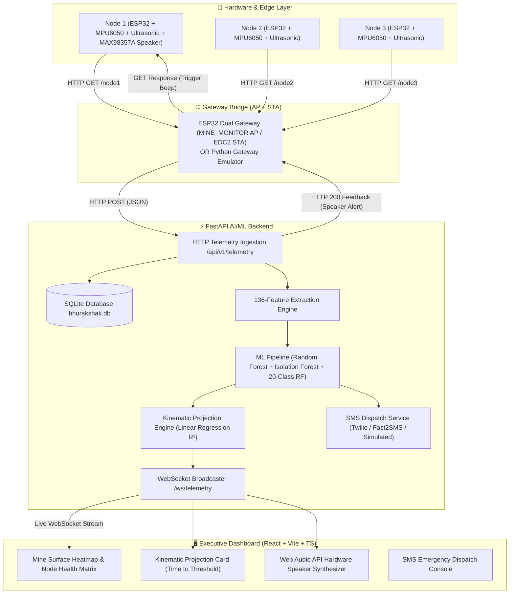

# 🛡️ BhuRakshak (भू-रक्षक)
### AI/ML-Powered Real-Time Underground Mine Safety & Ground Subsidence Monitoring System

[](https://fastapi.tiangolo.com/)
[](https://reactjs.org/)
[](https://vitejs.dev/)
[](https://scikit-learn.org/)
[](https://www.espressif.com/)

**BhuRakshak** is an end-to-end, enterprise-grade IoT & AI/ML decision-support system designed to monitor surface displacement, ground tilt, micro-vibrations, and structural deformation in underground mining environments.

The system pairs multi-sensor ESP32 hardware mesh nodes with an advanced 136-feature machine learning pipeline, a dynamic kinematic projection engine, real-time WebSockets, automated SMS emergency dispatch, hardware speaker alerts, and an executive React dashboard.

---

## 📸 System Architecture



---

## ✨ Key Features

### 1. 🤖 Multi-Model AI/ML Pipeline
- **136-Feature Window Extractor**: Buffers rolling 30-sample sensor windows to compute statistical moments (mean, std, skew, kurtosis), velocity, acceleration, peak-to-peak amplitude, FFT spectral energy, and cross-axis IMU correlations.
- **Binary Random Forest Classifier**: High-precision ground subsidence detection.
- **Isolation Forest**: Unsupervised anomaly detection for sudden micro-geological shifts.
- **20-Class Scenario Classifier**: Classifies underground events into distinct mine posture scenarios.

### 2. 📈 Kinematic Projection Engine (Time to Threshold)
- Performs real-time **Least-Squares Linear Regression** ($y = m \cdot t + c$) over displacement ($mm/hr$) and tilt ($deg/hr$).
- Forecasts **Estimated Time to Threshold** (`DISPLACEMENT_THRESHOLD_MM = 15.0 mm`, `TILT_THRESHOLD_DEG = 5.0°`).
- Evaluates **Model Confidence ($R^2\%$)**, remaining **Safety Margin**, and **Progress Percentage**.
- Includes geotechnical noise filtering ($< 0.10\text{ mm/hr}$ treated as static baseline noise) to prevent false long-tail projections.

### 3. 🔊 Dual Hardware & Web Audio Speaker Alerts
- **Hardware I2S Audio DAC (MAX98357A)**: On-site Node 1 speaker plays 900 Hz slow double-beeps for warnings and 1500 Hz fast triple-beeps for critical subsidence.
- **Bi-Directional Gateway Bridge**: The ESP32 Gateway receives backend AI/ML evaluations and signals Node 1 to sound alarms instantly.
- **Web Audio API Synthesizer**: Dashboard UI synthesizes matching hardware alarm tones directly in the browser with header mute/unmute controls.

### 4. 📱 SMS Emergency Dispatch Console
- Integrated multi-provider SMS dispatch system (**Twilio**, **Fast2SMS**, or **Live Simulator**).
- Automated SMS alerts to registered mine safety supervisors upon critical subsidence detection.
- Manual 1-click Emergency Broadcast Console at `/admin/sms` with delivery status logs.

### 5. 🖥️ Executive React Dashboard
- **Mine Surface Heatmap**: Color-coded spatio-temporal risk visualization.
- **Node Diagnostics Matrix**: Detailed MPU6050 accelerometer ($g$) & gyroscope ($deg/s$) telemetry decomposition, voltage, RSSI, and signal strength.
- **Real-Time Recharts Trends**: Interactive tilt and vibration time-series graphs.
- **Live Scenario Simulator**: Interactive control bar (`NORMAL`, `DEVELOPING`, `ALERT`, `CRITICAL`) for instant pipeline demonstration.

---

## 🛠️ Project Structure

```
bhurakshak_antigravity/
├── backend/
│   ├── app/
│   │   ├── api/                  # FastAPI REST routers (nodes, telemetry, analytics, sms, auth)
│   │   ├── db/                   # Database store (store.py - SQLite schema & queries)
│   │   ├── ml/                   # ML inference, feature_extractor.py, and joblib model files
│   │   ├── schemas/              # Pydantic data schemas
│   │   ├── services/             # Core logic (telemetry, kinematic, node health, alert, sms)
│   │   ├── websocket/            # WebSocket connection manager
│   │   ├── config.py             # Global application configuration
│   │   └── main.py               # FastAPI application entry point
│   ├── simulation/
│   │   └── gateway_emulator.py   # Python ESP32 HTTP Gateway emulator
│   ├── test_kinematic.py         # Unit tests for KinematicProjectionEngine
│   └── test_speaker_response.py  # Unit tests for TelemetryResponse & Speaker Alert
├── frontend/
│   ├── src/
│   │   ├── api/                  # Axios & Fetch API client
│   │   ├── components/           # UI components (Heatmap, NodeHealthMatrix, Sidebar, Header)
│   │   ├── pages/                # AdminDashboard, NodeDetail, AdminSms, AdminAlerts, Login
│   │   ├── types/                # TypeScript interfaces (NodeState, KinematicProjection, etc.)
│   │   ├── utils/                # AudioAlert synthesizer (Web Audio API)
│   │   ├── App.tsx               # Application routes & layout
│   │   └── main.tsx              # React entry point
│   └── package.json
├── hardware/
│   └── esp32_gateway/
│       └── esp32_gateway.ino     # C++/Arduino ESP32 Gateway firmware (AP+STA + Speaker Feedback)
└── README.md
```

---

## 🚀 Getting Started

### Prerequisites
- **Python**: `3.10` or higher
- **Node.js**: `v18` or higher (`npm`)
- **Arduino IDE** (Optional, for flashing physical ESP32 hardware)

---

### 1. Backend Setup (FastAPI)

1. Navigate to the backend directory:
   ```bash
   cd backend
   ```

2. Create and activate a Python virtual environment:
   ```bash
   python -m venv venv
   # On Windows (PowerShell):
   .\venv\Scripts\Activate.ps1
   # On Linux/macOS:
   source venv/bin/activate
   ```

3. Install required Python packages:
   ```bash
   pip install fastapi uvicorn pydantic pydantic-settings scikit-learn joblib numpy requests websockets
   ```

4. Start the FastAPI server:
   ```bash
   python -m uvicorn app.main:app --host 0.0.0.0 --port 8000 --reload
   ```
   > Backend API will be available at `http://localhost:8000`.  
   > Interactive Swagger Docs available at `http://localhost:8000/docs`.

---

### 2. Frontend Setup (React + Vite + TypeScript)

1. Open a new terminal and navigate to the frontend directory:
   ```bash
   cd frontend
   ```

2. Install dependencies:
   ```bash
   npm install
   ```

3. Start the Vite development server:
   ```bash
   npm run dev
   ```
   > React Dashboard will be live at `http://localhost:5173`.

---

### 3. Gateway & Simulation Setup

#### Option A: Python Software Emulator (No hardware required)
To test the full system without hardware, run the gateway emulator script:
```bash
python backend/simulation/gateway_emulator.py
```
Select a scenario (`1. Normal`, `2. Vibration Spike`, `3. Node Dropout`, `4. Critical Subsidence`) to push live telemetry to the backend.

#### Option B: Physical ESP32 Hardware
1. Flash [`hardware/esp32_gateway/esp32_gateway.ino`](file:///d:/projects/bhurakshak_antigravity/hardware/esp32_gateway/esp32_gateway.ino) to your ESP32 Gateway board using Arduino IDE.
2. Ensure `WIFI_SSID`, `WIFI_PASSWORD`, and `BACKEND_URL` in `esp32_gateway.ino` match your network setup.
3. Power on sensor nodes connected to the `MINE_MONITOR` Access Point.

---

## 🧪 Running Unit & System Verification Tests

To verify backend calculations and telemetry processing:

```bash
# Run Kinematic Projection Unit Tests
python backend/test_kinematic.py

# Run Telemetry & Speaker Alert Integration Tests
python backend/test_speaker_response.py
```

---

## 🛡️ License

This project is developed for **BhuRakshak Underground Mine Safety Monitoring**. All rights reserved.
